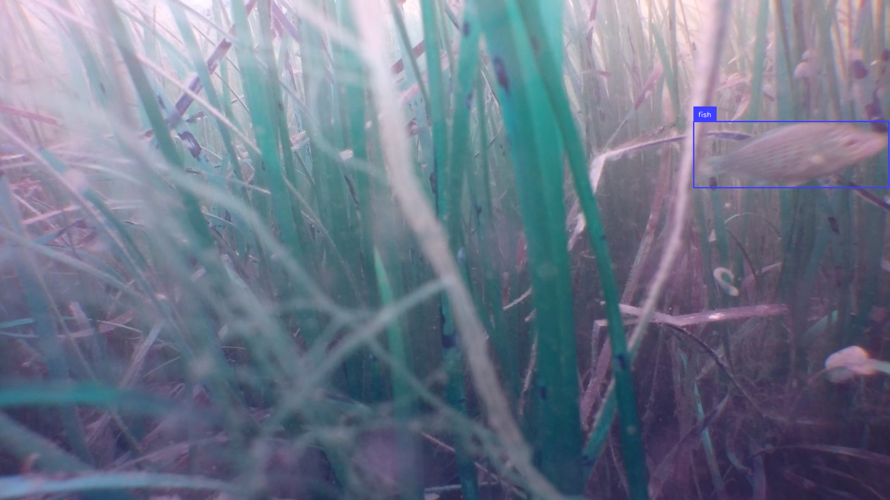
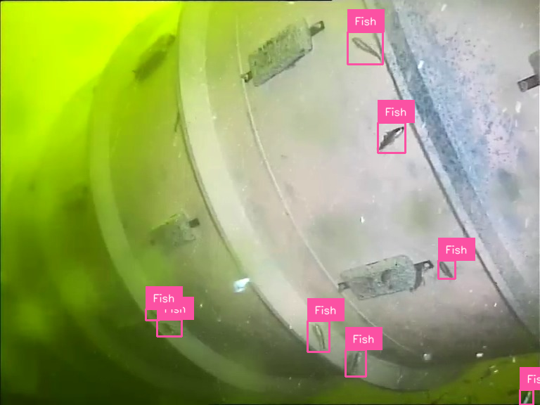
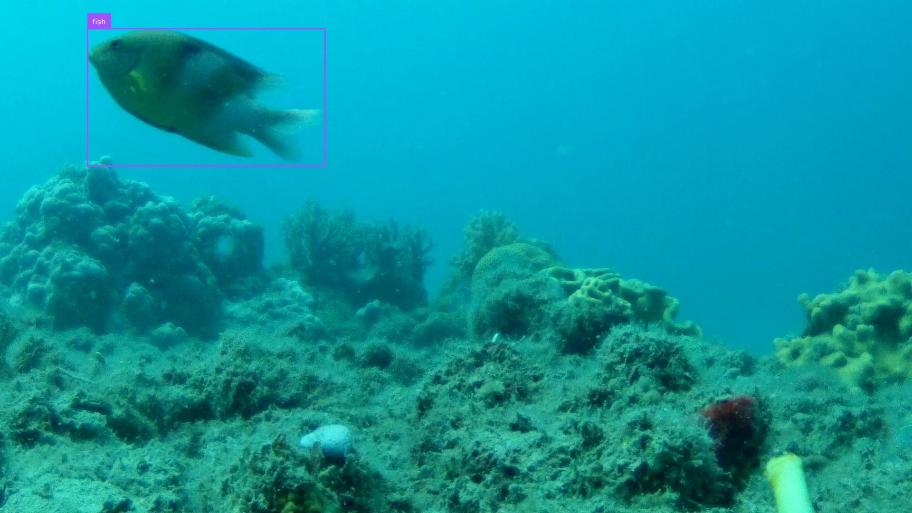
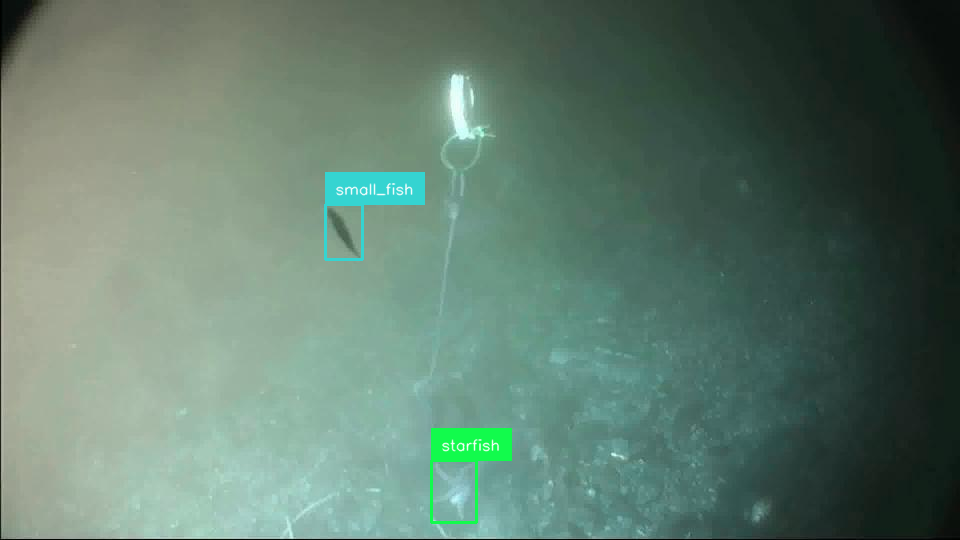
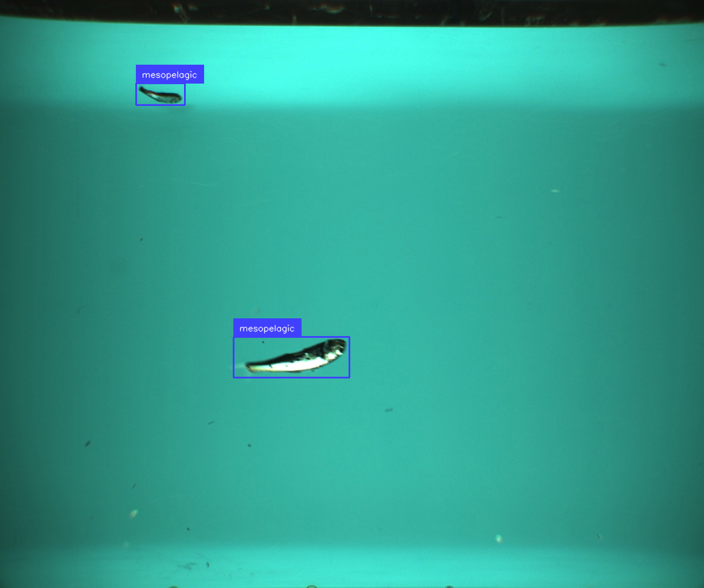
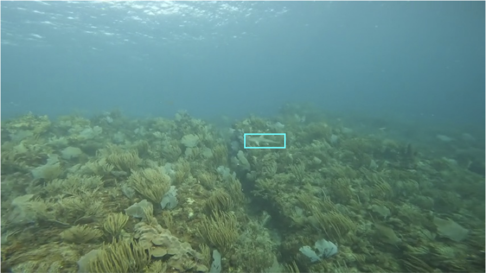
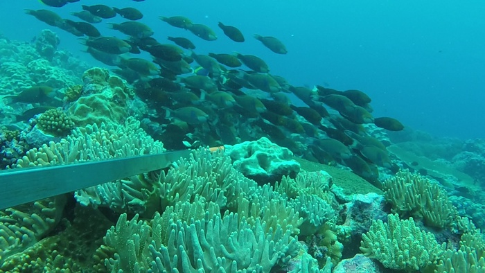

# Datasets with annotated fish in marine/freshwater imagery/video

## TOC

* <a href="#overview">Overview</a>
* <a href="#publicly-available-datasets">Publicly available datasets</a>

## Overview

This is a list of datasets with annotated marine/freshwater imagery, suitable for training fish detectors/classifiers. 

It was suggested by [Dan Morris](https://dmorris.net) to emulate the [list of datasets with annotated wildlife in drone/aerial images](https://github.com/agentmorris/agentmorrispublic/blob/main/drone-datasets.md), with standardized metadata for each dataset, and consistent sample code for match annotations to images and rendering sample images.

This effort was supported by the following folks:
* <a href="https://www.linkedin.com/in/filippo-varini/">Filippo Varini</a>
* <a href="https://dmorris.net">Dan Morris</a>
* <a href="https://www.mbari.org/person/kevin-barnard/">Kevin Barnard</a>
* <a href="https://www.mbari.org/person/laura-chrobak/">Laura Chrobak</a>
* <a href="https://www.oceaneboulais.net/">Oceane Boulais</a>
* <a href="https://alexvmt.github.io/">Alexander Merdian-Tarko</a>
* <a href="https://www.linkedin.com/in/kameswari-devi-ayyagari-031820b7/">Devi Ayyagari</a>
* <a href="https://www.linkedin.com/in/sonny-burniston/">Sonny Burniston</a>
* <a href="https://www.linkedin.com/in/mona-dhiflaoui/">Mona Dhiflaoui</a>

Email <a href="mailto:fppvrn@gmail.com">Filippo</a> if anything seems off, or if you know of datasets we're missing.

## Publicly available datasets

### NOAA Puget Sound Nearshore Fish 2017-2018

Images with 67,990 bounding boxes on fish and crustaceans
  
Farrell DM, Ferriss B, Sanderson B, Veggerby K, Robinson L, Trivedi A, Pathak S, Muppalla S, Wang J, Morris D, Dodhia R. A labeled data set of underwater images of fish and crab species from five mesohabitats in Puget Sound WA USA. Scientific Data. 2023 Nov 13;10(1):799.

* Data downloadable via via https from LILA (<a href="http://lila.science/wp-content/uploads/2022/07/noaa-estuary-thumb-800.png">download link</a>)
* License: CDLA-permissive 1.0
* Metadata raw format: COCO
* Categories/species: fish and crustaceans
* Vehicle type: N/A
* Image information: 77,739 images
* Annotation information: 67,990 bounding boxes
* Typical animal size in pixels: N/A
* Code to render sample annotated image: <a href="./data_preview/visualise_noaa_puget.py">visualise_noaa_puget.py</a>
  

  
  
### Project Natick Underwater Video

~1k images of fish/squid w/bounding boxes
  
Simon, K. (2018). Project Natick - Microsoft's Self-sufficient Underwater Datacenters. IndraStra Global, 4(6), 1-4.
https://nbn-resolving.org/urn:nbn:de:0168-ssoar-57615-2

* Data downloadable via via https from GitHub (<a href="https://github.com/Microsoft/Project_Natick_Analysis/releases/tag/annotated_data">download link</a>)
* Metadata raw format: Pascal VOC
* Categories/species: fish, squid
* Vehicle type: fixed camera on structure
* Image information: 1118 RGB images (~5% of images have FN annotations)
* Annotation information: 998 bounding boxes
* Typical animal size in pixels: N/A
* Code to render sample annotated image: <a href="./data_preview/visualise_project_natick.py">visualise_project_natick.py</a>
  

  
  
### Roboflow Fish Dataset

~1k images of fish w/bounding boxes
  
Solawetz, J. (2023, February 21). Fish object detection dataset. Roboflow. https://public.roboflow.com/object-detection/fish 

* Data downloadable via via https from Roboflow (<a href="https://public.roboflow.com/object-detection/fish/1">download link</a>)
* License: CC0 1.0 DEED
* Metadata raw format: multiple available
* Categories/species: 26 fish types (e.g. shark, tuna)
* Vehicle type: underwater cameras
* Image information: 1350 RGB images (the taxonomy is often inaccurate)
* Annotation information: 3142 bounding boxes
* Typical animal size in pixels: N/A
* Code to render sample annotated image: <a href="./data_preview/visualise_roboflow_fish.py">visualise_roboflow_fish.py</a>
  

  
  
### The Fishnet Dataset

~163k bounding boxes on ~35k images of fish and people on fishing vessels
  
Kay, J., & Merrifield, M. (2021). The Fishnet Open Images Database: A Dataset for Fish Detection and Fine-Grained Categorization in Fisheries. Retrieved from https://arxiv.org/abs/2106.09178

* Data downloadable via via https from The Nature Conservancy (<a href="https://www.fishnet.ai/">download link</a>)
* Metadata raw format: csv
* Categories/species: 34 fish types and humans
* Vehicle type: on-deck cameras
* Image information: 143,818 RGB images
* Annotation information: 549,209 bounding boxes
* Typical animal size in pixels: N/A
* Code to render sample annotated image: <a href="./data_preview/visualise_fishnet.ipynb">visualise_fishnet.ipynb</a>
  

  
  
### DeepFish

~40k images with a mix of classification, segmentation, and counting labels
  
Saleh A, Laradji IH, Konovalov DA, Bradley M, Vazquez D, Sheaves M. A realistic fish-habitat dataset to evaluate algorithms for underwater visual analysis. Scientific Reports. 2020 Sep 4;10(1):14671.

* Data downloadable via https from Queensland University (<a href="https://alzayats.github.io/DeepFish/">download link</a>) (7.1GB)
* License: Code is MIT, data is implied-MIT
* Metadata raw format: png (segmentation masks)
* Categories/species: 
* Vehicle type: underwater camera deployed over the side of a boat
* Image information: 311 images with segmentation masks
* Annotation information: 388 segmentation masks
  
  
  
### The Brackish Dataset

~90 videos with bounding boxes on fish
  
Detection of Marine Animals in a New Underwater Dataset with Varying Visibility, Pedersen, Malte and Haurum, Joakim Bruslund and Gade, Rikke and Moeslund, Thomas B. and Madsen, Niels, June, 2019

* Data downloadable via via https from Kaggle (<a href="https://www.kaggle.com/datasets/aalborguniversity/brackish-dataset">download link</a>)
* License: CC BY-SA 4.0
* Metadata raw format: AAU, COCO, YOLO
* Categories/species: fish, small fish, crab, shrimp, jellyfish, starfish
* Vehicle type: underwater cameras in brackish water
* Image information: 12,444 RGB images
* Annotation information: 35,565  bounding boxes
* Typical animal size in pixels: N/A
* Code to render sample annotated image: <a href="./data_preview/visualise_brackish_dataset.py">visualise_brackish_dataset.py</a>
  

  
  
### Deep Vision Fish Dataset

Bboxed images of pelagic fish and associated segmentations
  
Vaneeda Allken, Shale Rosen (2020) Deep Vision fish dataset https://doi.org/10.21335/NMDC-551736490

* Data downloadable via via https from the Norwegian Marine Data Centre (<a href="https://metadata.nmdc.no/metadata-api/landingpage/01d102345aef4639f063a13ea20cd3f3">download link</a>)
* License: CC BY 4.0
* Metadata raw format: csv
* Categories/species: economically important pelagic species
* Vehicle type: pictures from fish tanks
* Image information: 1875 RGB images
* Annotation information: 4834 bounding boxes, segmentation masks
* Typical animal size in pixels: N/A
* Code to render sample annotated image: <a href="./data_preview/visualise_deep_vision.ipynb">visualise_deep_vision.ipynb</a>
  

  
  
### BrackishMOT

98 videos of fish with tracking boxes (i.e., boxes with stable frame-to-frame IDs)
  
Pedersen, Malte; Lehotský, Daniel; Nikolov, Ivan; Moeslund, Thomas B.  10.48550/ARXIV.2302.10645,BrackishMOT: The Brackish Multi-Object Tracking Dataset,arXiv,2023

* Data downloadable via https from Kaggle (<a href="https://www.kaggle.com/datasets/maltepedersen/brackishmot">download link</a>)
* License: CC BY-NC-SA 4.0
* Metadata raw format: N/A
* Categories/species: small fish
* Vehicle type: underwater cameras in brackish water
* Image information: N/A
* Annotation information: N/A
* Typical animal size in pixels: N/A
* Code to render sample annotated image: <a href="./data_preview/visualise_brackishmot.ipynb">visualise_brackishmot.ipynb</a>
  

  
  
### Visual Marine Animal Tracking

32 video sequences with bounding boxes on a variety of species
  
Cai, L., McGuire, N.E., Hanlon, R. et al. Semi-supervised Visual Tracking of Marine Animals Using Autonomous Underwater Vehicles. Int J Comput Vis 131, 1406–1427 (2023). https://doi.org/10.1007/s11263-023-01762-5

* Data downloadable via from Springer (<a href="https://link.springer.com/article/10.1007/s11263-023-01762-5#article-info">download link</a>)
* License: CC BY 4.0 DEED
* Metadata raw format: N/A
* Categories/species: marine organisms
* Vehicle type: autonomous underwater vehicles
* Image information: N/A
* Annotation information: N/A
* Typical animal size in pixels: N/A
* Code to render sample annotated image: <a href="./data_preview/visualise_vmat.ipynb">visualise_vmat.ipynb</a>

  
  
### OzFish

80k cropped fish images with 45k bounding boxes
  
Australian Institute of Marine Science (AIMS), University of Western Australia (UWA) and Curtin University. (2019). OzFish Dataset - Machine learning dataset for Baited Remote Underwater Video Stations . https://doi.org/10.25845/5e28f062c5097, accessed 28-Feb-2024.

* Data downloadable via https from GitHub (<a href="https://github.com/open-AIMS/ozfish?tab=readme-ov-file">download link</a>)
* License: CC BY 3.0 DEED
* Metadata raw format: N/A
* Categories/species: N/A
* Vehicle type: BRUV
* Image information: Over 3000 images
* Annotation information: bounding boxes
* Typical animal size in pixels: N/A
  

  
  
### F4K Detection and Tracking

17 10-minute videos with tracking points
  
I. Kavasidis, S. Palazzo, R. Di Salvo, D. Giordano, C. Spampinato, An innovative web-based collaborative platform for video annotation, Multimedia Tools and Applications, vol. 70, pp. 413-432, 2013.

I. Kavasidis, S. Palazzo, R. Di Salvo, D. Giordano, C. Spampinato, A semi-automatic tool for detection and tracking ground truth generation in videos, Proceedings of the 1st International Workshop on Visual Interfaces for Ground Truth Collection in Computer Vision Applications, pp. 6:1-6:5, 2012.

* Data downloadable via https from GitHub (<a href="https://github.com/perceivelab/f4k-detection-and-tracking">download link</a>)
* Metadata raw format: XML, FLV
* Categories/species: N/A
* Vehicle type: N/A
* Image information: N/A
* Annotation information: N/A
* Typical animal size in pixels: N/A
  

  
  
### FishCLEF-2015 

14k boxes on fish in 20k images
  
Joly A., Goeau H., Glotin H., Spampinato C., Bonnet P., Vellinga W.-P., Planquè R., Rauber A., Palazzo S., Fisher R., and others}, LifeCLEF 2015: multimedia life species identification challenges, International Conference of the Cross-Language Evaluation Forum for European Languages, pp. 462-483, Springer, 2015.

* Data downloadable via https from Github (<a href="https://github.com/perceivelab/FishCLEF-2015">download link</a>)
* Metadata raw format: XML
* Categories/species: marine ray-finned fish 
* Vehicle type: N/A
* Image information: 20m000 images
* Annotation information: 14,000 bounding boxes
* Typical animal size in pixels: N/A
  

  
  
### VIAME FishTrack

Several thousand BRUV images with bounding boxes on fish and bait
  
* Data downloadable from Viame (<a href="https://viame.kitware.com/#/collection/62afcb66dddafb68c8442126">download link</a>)
* Metadata raw format: N/A
* Categories/species: N/A
* Vehicle type: BRUV
* Image information: thousands of images
* Annotation information: bounding boxes
* Typical animal size in pixels: N/A
  

  
  
### Brackish Underwater Dataset

12.5k boxes on fish and other species in 15k images
  
Pedersen, M., Haurum, J. B., Gade, R., Moeslund, T. B., & Madsen, N. (2019). Detection of Marine Animals in a New Underwater Dataset with Varying Visibility. In The IEEE Conference on Computer Vision and Pattern Recognition (CVPR) Workshops, June 2019.

* Data downloadable via https from Roboflow (<a href="https://public.roboflow.com/object-detection/brackish-underwater/">download link</a>)
* License: CC BY 4.0 DEED 
* Metadata raw format: YOLOv2, YOLOv3 CNNs
* Categories/species: marine animals
* Vehicle type: underwater cameras
* Image information: 14,674 images (12,444 of which contain objects of interest with bounding box annotations)
* Annotation information: bounding boxes
* Typical animal size in pixels: 416 × 416
  

  
  
### WildFish

54,459 images of fish in 1000 categories
  
Zhuang, P., Wang, Y., & Qiao, Y. (2018). WildFish: A Large Benchmark for Fish Recognition in the Wild. In 2018 ACM Multimedia Conference on Multimedia Conference (pp. 1301-1309). ACM

* Data downloadable via https from Github (<a href="https://github.com/PeiqinZhuang/WildFish">download link</a>)
* Metadata raw format: N/A
* Categories/species: N/A
* Vehicle type: N/A
* Image information: 54,459 images
* Annotation information: N/A
* Typical animal size in pixels: N/A
  

  
  
### Object detection of tropical freshwater fish in Australia

~44k images of fish w/ ~83kbounding boxes
  
Jansen, A., Walden, D., Walker, S., & Buccella, C. (2022). A deep learning dataset for underwater object detection of tropical freshwater fish species in northern Australia (1.0) [Data set]. Zenodo. https://doi.org/10.5281/zenodo.7250921

* Data downloadable via https from zenodo (<a href="https://zenodo.org/records/7250921#.ZEAmZezMJqs">download link</a>)
* License: CC BY 4.0 LEGAL CODE
* Metadata raw format: json
* Categories/species: Ambassis agrammus, Ambassis macleayi, Amniataba percoides, Craterocephalus stercusmuscarum, Denariusa bandata, Glossamia aprion, Glossogobius spp., Hephaestus fuliginosus, Lates calcarifer, Leiopotherapon unicolor, Liza ordensis, Megalops cyprinoides, Melanotaenia nigrans, Melanotaenia splendida inornata, Mogurnda mogurnda, Nemetalosa erebi, Neoarius spp., Neosilurus spp., Oxyeleotris spp., Scleropages jardinii, Strongylura kreffti, Syncomistes butleri, Toxotes chatareus
* Vehicle type: RUV
* Image information: 44,112 images (images were derived from Remote Underwater Video (RUV) deployments in deep channel and shallow lowland billabongs, Kakadu National Park, Northern Territory Australia)
* Annotation information: 82,904 bounding boxes
* Typical animal size in pixels: N/A
  

  
  
### AFFiNe

7k labeled images of freshwater fish, generally not in the water, cropped close
  
* Data downloadable via https from Kaggle (<a href="https://www.kaggle.com/datasets/jorritvenema/affine">download link</a>)
* License: CC BY-NC-SA 4.0 DEED
* Metadata raw format: YOLO
* Categories/species: N/A
* Vehicle type: N/A
* Image information: >7000 images
* Annotation information: N/A
* Typical animal size in pixels: N/A
  

  
  
### Brook trout imagery for individual ID

435 images of brook trout with individual ID labels

  
Hitt, N.P., Kessler, K.G., and Letcher, B.H., 2022, Brook trout imagery data for individual recognition with deep learning: U.S. Geological Survey data release, https://doi.org/10.5066/P94UL1Z1.

* Data downloadable via via browser from ScienceBase (<a href="https://www.sciencebase.gov/catalog/item/627e8af0d34e3bef0c9a2cde">download link</a>)
* Metadata raw format: xml
* Categories/species: N/A
* Vehicle type: GoPro camera mounted approximately 50 cm above a fish board
* Image information: 435 images (images were collected at the Paint Bank State Fish Hatchery (Paint Bank, VA) on August 9, 2021 using a GoPro Hero 9)
* Annotation information: N/A
* Typical animal size in pixels: N/A
  

  
  
### AAU Zebrafish Re-Identification Dataset

2200 images of zebrafish with individual IDs
  
Bruslund Haurum J, Karpova A, Pedersen M, Hein Bengtson S, Moeslund TB. Re-identification of zebrafish using metric learning. InProceedings of the IEEE/CVF winter conference on applications of computer vision workshops 2020 (pp. 1-11).

* Data downloadable via https from Kaggle (<a href="https://www.kaggle.com/datasets/aalborguniversity/aau-zebrafish-reid">download link</a>)
* License: CC BY 4.0 DEED
* Metadata raw format: csv
* Categories/species: zebrafish
* Vehicle type: underwater camera in fish tank
* Image information: 2224 images
* Annotation information: AAU VAP bounding boxes
* Typical animal size in pixels: N/A
* Code to render sample annotated image: <a href="./data_preview/visualize_Zebrafish_dataset.ipynb">visualize_Zebrafish_dataset.ipynb</a>
  

  
  
### 3D-ZeF20

Eight long stereo video sequences of zebrafish with boxes and keypoints
  
3D-ZeF: A 3D Zebrafish Tracking Benchmark Dataset, Pedersen, Malte and Haurum, Joakim and Bengtson, Stefan and Moeslund, Thomas, Proceedings of the IEEE Conference on Computer Vision and Pattern Recognition, 250--259, 2020

* Data downloadable via https from MOTchallenge (<a href="https://motchallenge.net/data/3D-ZeF20">download link</a>)
* License: CC BY-NC-SA 3.0 DEED
* Metadata raw format: json
* Categories/species: zebrafish
* Vehicle type: multi-object tracking (MOT) and 3D tracking
* Image information: 8 RGB images
* Annotation information: 86,400 bounding boxes and head points
* Typical animal size in pixels: N/A
  

  
  
### Salmon Computer Vision

Boxes on 532,000 frames from 1,567 videos of salmon in two weirs
  
JOUR, Atlas, William, Ma, Sami, Chou, Yi, Connors, Katrina, Scurfield, Daniel, Nam, Brandon, Ma, Xiaoqiang, Cleveland, Mark, Doire, Janvier, Moore, Jonathan, Shea, Ryan, Liu, Jiangchuan, 2023/09/20, Wild salmon enumeration and monitoring using deep learning empowered detection and tracking, 10, 10.3389/fmars.2023.1200408, Frontiers in Marine Science

* Data downloadable via https from GitHub (<a href="https://github.com/Salmon-Computer-Vision/salmon-computer-vision">download link</a>)
* License: CC BY 4.0 
* Metadata raw format: YOLOv6
* Categories/species: pacific salmon
* Vehicle type: multi-object tracking (MOT) and object detection
* Image information: 1567 images
* Annotation information: bounding boxes
* Typical animal size in pixels: N/A
  

### FathomNet Database

Katija, K., Orenstein, E., Schlining, B. _et al._ FathomNet: A global image database for enabling artificial intelligence in the ocean. Sci Rep 12, 15914 (2022). [https://doi.org/10.1038/s41598-022-19939-2](https://doi.org/10.1038/s41598-022-19939-2)

The FathomNet Database is an open-source image database that can be used to train, test, and validate state-of-the-art artificial intelligence algorithms to help us understand our ocean and its inhabitants. 

* Data downloadable via https from FathomNet (<a href="https://fathomnet.org/">website</a>)
* License: CC BY-NC-ND 4.0 with provision: _Notwithstanding any contrary provisions of such license, all Images may be used for training and development of machine learning algorithms for commercial, academic, and government purposes. For all other uses of the Images, users should contact the original copyright holder indicated in the Database for the applicable Images. The users of the Images accept full responsibility for their use._ (<a href="https://fathomnet.org/fathomnet/#/license">source</a>)
* Metadata raw format: N/A (exportable via [fathomnet-py](https://github.com/fathomnet/fathomnet-py) to VOC, COCO, YOLO)
* Categories/species: many (2400+ concepts in the database)
* Vehicle type: primarily ROV
* Image information: 100k+ images (growing over time)
* Annotation information: 300k+ annotations (growing over time)
* Typical animal size in pixels: N/A

